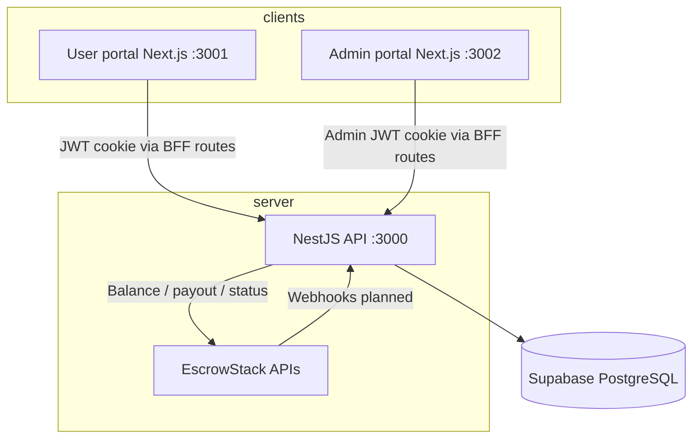

# CTPay / Escrow — Project Overview

This document describes how the **Escrow monorepo** works end to end: product purpose, architecture, money flows, database, APIs, and what each app does. Use it as context when onboarding, debugging, or feeding the codebase to an AI assistant.

---

## What this product is

**CTPay** is a closed-loop **B2B payout and ledger platform** for known merchants (not a public payment gateway).

- **Provider:** EscrowStack (HDFC / VouchPay)
- **Inbound:** Deposits only from **whitelisted** bank accounts into merchant virtual accounts
- **Outbound:** Merchants request bank transfers; **admin approves** before money leaves escrow
- **Branding:** User-facing product name is **CTPay**; repo folder is `escrow`

Merchants use the **user portal** to view balance, load funds, and request payouts. Admins use the **admin portal** to onboard merchants, manage balances, and approve/reject transfers. All EscrowStack API keys, RSA private keys, and payout signing happen **only on the backend**.

---

## Monorepo layout

| App | Path | Dev port | Production (planned) |
|-----|------|----------|----------------------|
| **User portal** | `apps/user-portal` | 3001 | Vercel — merchant domain |
| **Admin portal** | `apps/admin-portal` | 3002 | Vercel — `admin.*` |
| **Backend API** | `apps/backend` | 3000 | Hostinger VPS — `api.*` (PM2 + Nginx) |

**Package manager:** pnpm workspace  
**Database:** Supabase (PostgreSQL)  
**Migrations:** `apps/backend/supabase/migrations/` (run manually in Supabase SQL Editor)

**Reference files (repo root):**

- `payout.cts.txt` — Node RSA-SHA256 signing + payout flow (IST timestamp)
- `EStack-ESCROW-HDFC Chakrathalwar.postman_collection (1).json` — full EscrowStack API collection
- `Readme.md` — quick start and commands
- `.cursorrules` — Cursor agent rules for this repo

---

## High-level architecture



Both frontends are **Next.js** apps that call the backend through **same-origin API routes** (`apps/*/src/app/api/...`). They never receive EscrowStack credentials.

---

## Database (Supabase)

Run migrations **in order** (`001` … `011`).

| Migration | Purpose |
|-----------|---------|
| `001_create_users` | Merchant login users |
| `002_create_admins` | Admin accounts |
| `003_users_plain_password` | Merchant passwords stored plain (admin-visible) |
| `004_create_merchants` | EscrowStack credentials, virtual account, encrypted keys |
| `005_merchant_real_demo_balance` | `real_balance`, `demo_balance` columns |
| `006_create_transfers` | Payout requests + status lifecycle |
| `007_transfer_utr` | UTR / bank ref on transfers |
| `008_merchant_balance_mode` | `balance_mode`: `real` \| `demo` — what merchant portal displays |
| `009_transfer_batches` | Bulk upload batch grouping |
| `010_merchant_account_status` | `active` \| `on_hold` \| `terminated` |
| `011_admins_plain_password` | Admin passwords stored plain (like merchants) |

### Core tables (conceptual)

**`users`** — portal login (username, plain password, linked to merchant)

**`admins`** — admin portal login (plain password, editable in Supabase)

**`merchants`** (extends user):

- EscrowStack: `api_key`, `encrypted_private_key`, `virtual_account_no`, `escrow_ifsc`
- Ledger: `real_balance`, `demo_balance`, `pending_balance`
- Display: `balance_mode` (`real` \| `demo`)
- Access: `account_status` (`active` \| `on_hold` \| `terminated`)

**`transfers`**:

- `merchant_id`, `amount`, beneficiary fields, `payout_mode`, `payout_ref`
- `status`: `PENDING_APPROVAL` → `PROCESSING` → `SUCCESS` \| `FAILED` \| `REJECTED`
- `batch_id` (optional, bulk uploads)
- `utr`, `bank_ref`, `escrow_response`

---

## Money flows

### 1. Inbound deposit (whitelisted)

1. Known customer sends IMPS/NEFT/RTGS to merchant **virtual account**
2. EscrowStack webhook → backend (planned) credits `real_balance`
3. Admin may refresh **real (bank)** balance from EscrowStack API
4. User portal shows **available** balance per `balance_mode` (real or demo)

### 2. Outbound payout (pending trick)

This is the core ledger pattern:

| Step | Who | What happens |
|------|-----|----------------|
| 1 | Merchant | Submits transfer on user portal |
| 2 | Backend | Deducts **available**, adds **pending_balance**, creates transfer `PENDING_APPROVAL` |
| 3 | Admin | Approves or rejects on admin portal |
| 4a | Approve | Backend decrypts RSA key, signs payload, POST to EscrowStack → `PROCESSING` |
| 4b | Reject | Status `REJECTED`, funds returned to available |
| 5 | Bank / webhook | Success → `SUCCESS`, remove from pending; failure → `FAILED`, refund available |

### 3. Real vs demo balance

| Field | Meaning | Admin | User portal |
|-------|---------|-------|-------------|
| `real_balance` | Live EscrowStack bank balance | Shown + refresh | Shown only if `balance_mode = real` |
| `demo_balance` | Manual display balance | Editable | Shown only if `balance_mode = demo` |
| `balance_mode` | Which balance CTPay shows merchants | Toggle per merchant | Determines available/pending display |
| `pending_balance` | Funds held for in-flight payouts | Shown under real balance | Shown on dashboard |

Admin sets **CTPay shows Real / Demo** via glass segmented toggle on merchant list and detail.

### 4. Account status

| Status | User portal |
|--------|-------------|
| `active` | Full access |
| `on_hold` | View balance + history; **transfers blocked** |
| `terminated` | Read-only; no new transfers |

When not `active`:

- Top **banner** in portal shell explains restrictions
- **Status badge** on account dashboard, profile dropdown, and mobile menu (Active / On hold / Terminated)
- Transfer button disabled on dashboard; backend rejects `POST /transfers` via `assertCanTransfer()`

---

## EscrowStack integration (backend only)

**Services:** `apps/backend/src/escrowstack/`

- Balance: `POST /v1/escrow/fetch_transaction_account_balance`
- Payout: `POST` payout prod URL with signed JSON
- Payout status: `POST /v1/escrow/get_payout_status`
- Signing: RSA-SHA256 on unsigned JSON + `timestamp` (IST), then attach `signature`; header `apikey`

**Security:**

- Per-merchant RSA keys generated on create, **AES-256 encrypted at rest**
- Decrypted in memory only when approving a payout
- Never expose keys, API secrets, or signing logic to frontends

**Payout lifecycle (EscrowStack):**

- Submitted → webhook `processed` (`PO_BP_DCP`) or `failed` (`ERR_BP_IPR`)
- Reconcile job polls status when webhook not yet wired (`transfer-reconcile.service.ts`)

---

## Backend API (NestJS)

Base URL: `http://localhost:3000` (dev)

### Health

- `GET /health` — Supabase connectivity check

### Merchant auth (`/auth`)

- `POST /auth/login`, `POST /auth/logout`, `GET /auth/me`
- JWT in httpOnly cookie (separate from admin JWT)

### Merchant transfers (`/transfers`) — JWT required

- `GET /transfers` — list merchant’s transfers
- `POST /transfers` — single IMPS/NEFT/RTGS/UPI request
- `POST /transfers/bulk` — batch upload (many rows → one `batch_id`)
- `POST /transfers/reconcile-status` — poll EscrowStack for processing UTR updates

### Admin auth (`/admin/auth`)

- `POST /admin/auth/bootstrap` — first admin only (empty table)
- `POST /admin/auth/login`, `GET /admin/auth/me`, `POST /admin/auth/logout`

### Admin merchants (`/admin/users`) — admin JWT

- `GET /admin/users` — list merchants with balances
- `POST /admin/users/fetch-escrow-details` — validate API key + keypair before onboard
- `POST /admin/users` — create merchant (encrypt keys, create user)
- `PATCH /admin/users/:id` — username, password, demo balance, balance_mode, account_status
- `POST /admin/users/:id/refresh-balance` — fetch real balance from EscrowStack
- `DELETE /admin/users/:id`

### Admin transfers (`/admin/transfers`) — admin JWT

- `GET /admin/transfers` — all transfers (filter by status, merchant)
- `POST /admin/transfers/:id/approve` — sign + submit payout
- `POST /admin/transfers/:id/reject` — release held funds
- `POST /admin/transfers/batches/:batchId/approve-all` — approve whole bulk batch
- `POST /admin/transfers/reconcile-status` — admin-wide status poll

---

## Admin portal (`apps/admin-portal`)

**URL:** `localhost:3002`

### Routes

| Route | Purpose |
|-------|---------|
| `/login` | Admin sign-in |
| `/` | **Merchants hub** — stats, onboard form, merchant table |
| `/merchants/[id]` | Merchant detail — status toggle, real/demo toggle, balances, portal access, embedded transfers |

Transfers are managed **per merchant** on the detail page (not a separate global transfers page in current UI).

### Key features

- Onboard merchant: fetch EscrowStack details → create user + encrypted credentials
- Glass **iOS-style segmented controls**: portal status (Active / On hold / Terminated), CTPay balance mode (Real / Demo)
- Approve/reject transfers with confirm dialog
- Yes/No confirm dialogs for status changes, deletes, batch approve, and other sensitive actions
- Refresh real bank balance per merchant
- Mobile-responsive: hamburger nav, card layouts on small screens

### UI system

- `src/lib/glass-styles.ts` — frosted surfaces, inset tiles, table rows
- `src/components/ui/glass-card.tsx`, `glass-segmented-control.tsx`
- Light gradient shell, frosted header, professional bank-like tables

---

## User portal (`apps/user-portal`)

**URL:** `localhost:3001`  
**Product name:** CTPay

### Routes

| Route | Purpose |
|-------|---------|
| `/login` | Merchant sign-in |
| `/` | **Account** — balances, load account, IFSC, actions |
| `/transfer` | Single transfer wizard + bulk Excel/CSV upload |
| `/history` | Last 48 hours, search, export, transfer detail popup |

### Key features

- Dashboard: available / pending / settled today (light glass card, admin-style inset tiles)
- Single transfer: amount, beneficiary, account, IFSC → confirm → `PENDING_APPROVAL`
- Bulk transfer: sample sheet, drag-drop, preview table, submit batch
- History: full payment ref + UTR in table; detail popup matches admin fields
- CSV export: Excel-safe text for long numeric IDs (`="..."` formula + UTF-8 BOM)
- Account status badge on profile (Active / On hold / Terminated) — not hardcoded to Active
- Account status banners block transfers when on hold / terminated
- Mobile-responsive: stacked filters/buttons, history card view on small screens, viewport meta

### UI system

Same glass design language as admin (`glass-styles.ts`, `GlassCard`, frosted dialogs/inputs). Shared components: `AccountStatusBadge`, `AccountStatusBanner`, `canMerchantTransfer()`.

---

## Transfer statuses (both portals)

| Status | Merchant label | Meaning |
|--------|------------------|---------|
| `PENDING_APPROVAL` | Pending approval | Awaiting admin |
| `PROCESSING` | Processing | Sent to EscrowStack / bank |
| `SUCCESS` | Completed | Paid |
| `FAILED` | Failed | Bank failed; funds returned (webhook/reconcile) |
| `REJECTED` | Cancelled | Admin rejected; funds returned |

---

## Security rules (non-negotiable)

1. **Never** put EscrowStack API keys, RSA private keys, or AES master key in frontends or git
2. Separate JWT secrets: `JWT_SECRET` (users) vs `ADMIN_JWT_SECRET` (admins)
3. Merchant passwords: plain in DB (admin-managed visibility)
4. Admin passwords: plain in DB (editable in Supabase table editor) — migration `011`; treat DB access as full admin access
5. CORS limited to portal origins
6. Payout signing only in backend `escrowstack` + `transfers` services
7. Account status enforced server-side on transfer create (UI disable is supplementary)
8. After migration `011`, re-bootstrap admin or insert password before exposing API publicly

---

## Local development

```bash
pnpm install
pnpm dev:backend   # :3000
pnpm dev:user      # :3001
pnpm dev:admin     # :3002
```

Copy `apps/backend/.env.example` → `.env` and set Supabase, JWT, EscrowStack, `ESCROW_AES_MASTER_KEY`, `CORS_ORIGIN`.

First admin (once):

```powershell
Invoke-RestMethod -Uri "http://localhost:3000/admin/auth/bootstrap" -Method POST `
  -ContentType "application/json" `
  -Body '{"username":"admin","password":"admin123456"}'
```

See `Readme.md` for full migration list and env vars.

---

## Implementation roadmap (from `.cursorrules`)

| Step | Status | Description |
|------|--------|-------------|
| 1 | Done | Monorepo scaffold |
| 2 | Done | Supabase connected |
| 3 | Done | Admin auth + user CRUD |
| 4 | Done | Internal ledger + `PENDING_APPROVAL` |
| 5 | Done | EscrowStack signing engine |
| 6 | Partial | Webhooks + reconcile polling |
| 7 | Done | Admin approval UI |
| 8 | Done | User portal balance + transfers |
| 9 | Planned | CRON reconciliation (hourly) |
| 10 | Planned | Production deploy (Vercel + VPS) |

**Still planned / incomplete:**

- Deposit webhooks crediting `real_balance` automatically
- Full payout webhook handling (`SUCCESS` / `FAILED` without manual reconcile)
- Hourly Supabase vs bank balance reconciliation
- Production hosting cutover

---

## How frontends talk to the backend

Each Next.js app proxies authenticated requests:

- User: `apps/user-portal/src/app/api/**` → `backendFetch('/transfers')` etc. with session cookie
- Admin: `apps/admin-portal/src/app/api/**` → same pattern with admin session

Session cookies are httpOnly; middleware redirects unauthenticated users to `/login`.

---

## Using this document with AI / future you

When starting a new chat or agent session on this repo:

1. **Attach or paste `About.md`** plus `.cursorrules` for product and security context
2. Point to the specific app: `apps/user-portal`, `apps/admin-portal`, or `apps/backend`
3. For money bugs, trace: **user action → transfers.service → merchants ledger → EscrowStack**
4. For UI work, both portals share the **glass design system**; keep admin and user visually aligned
5. Schema changes always need a new file in `apps/backend/supabase/migrations/`

---

## GitHub

Repository: [github.com/0xali3n/escrow](https://github.com/0xali3n/escrow)

---

*Last updated: July 2026 — reflects merchant hub, bulk transfers, account status badges, Yes/No confirms, mobile polish, admin plain passwords (011), and full user/admin glass UI.*
